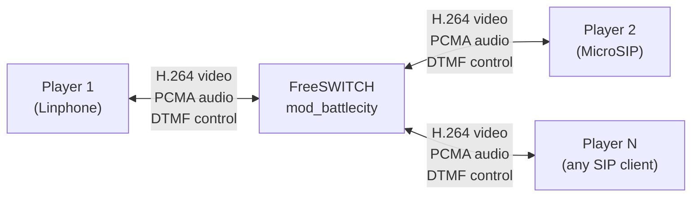
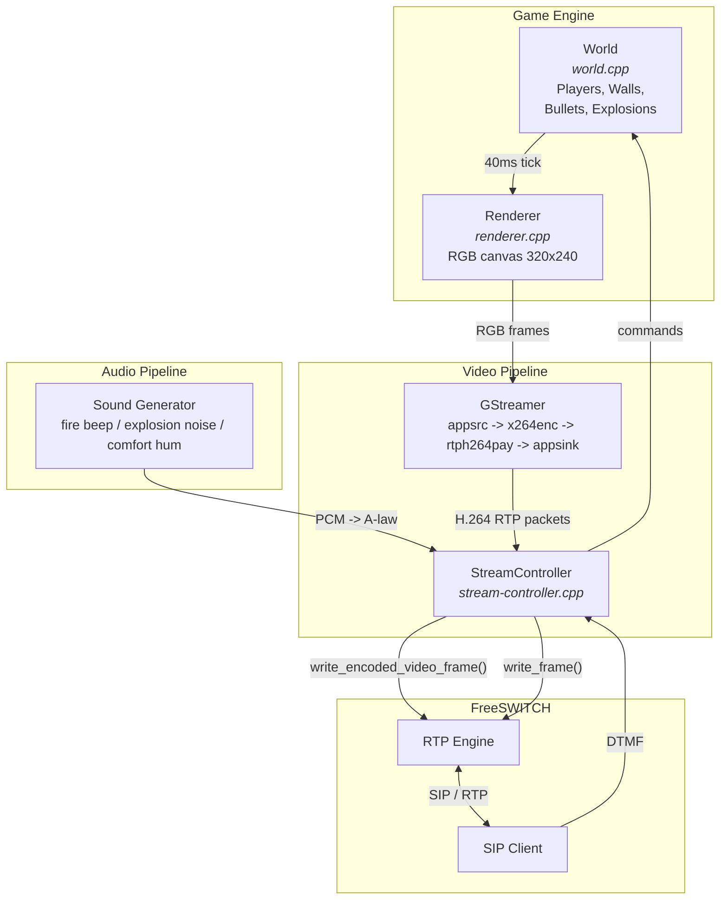

# mod_battlecity - Battle City over SIP Video Call

A FreeSWITCH module that serves a multiplayer Battle City game through SIP video calls. Players dial a number (e.g. 9999), see the game board as incoming video, and control their tank using DTMF keys on the phone dialpad.



## How it works

1. User makes a **video call** to extension 9999 on the FreeSWITCH server
2. FreeSWITCH answers and starts the Battle City game module
3. The game world is rendered to a 320x240 RGB canvas
4. GStreamer encodes the canvas to H.264 RTP and sends it as video
5. Player controls their tank via DTMF tones from the phone dialpad
6. Multiple players share the same game world - it's multiplayer!

## Controls

| Key | Action |
|-----|--------|
| 2   | Move North (up) |
| 8   | Move South (down) |
| 4   | Move West (left) |
| 6   | Move East (right) |
| 5   | Fire |

Press a direction key once to start moving, press again to stop. Press a different direction to turn.

## Architecture



- **world.cpp/h** - Game logic: players, walls, bullets, collisions, explosions. Thread-safe with rwlock.
- **renderer.cpp/h** - Renders game state to 320x240 RGB canvas using XPM sprites with rotation support.
- **gst-helper.cpp/h** - GStreamer pipelines for H.264 video encoding and audio.
- **stream-controller.cpp/h** - FreeSWITCH session management: SIP/RTP, codec negotiation, DTMF handling, video/audio frame delivery.
- **mod_battlecity.cpp** - FreeSWITCH module entry point. Registers the `play_battlecity` dialplan application.

## Building

### Prerequisites

- FreeSWITCH v1.10 source tree
- GStreamer 1.0 development libraries
- x264 (for H.264 encoding)
- Standard build tools (gcc/g++, autoconf, automake, libtool, pkg-config)

### macOS (Homebrew)

```bash
# Install dependencies
brew install gstreamer sofia-sip speex speexdsp ldns libedit \
    libtiff jpeg-turbo opus libsndfile autoconf automake libtool pkg-config pcre

# Build spandsp3 from FreeSWITCH fork (not available in Homebrew)
cd /tmp
git clone --depth 1 https://github.com/freeswitch/spandsp.git
cd spandsp && ./bootstrap.sh
LDFLAGS="-L/opt/homebrew/lib" CFLAGS="-I/opt/homebrew/include" \
    ./configure --prefix=/opt/homebrew
make -j$(sysctl -n hw.ncpu) && make install

# Clone FreeSWITCH
cd /tmp
git clone --depth 1 -b v1.10 https://github.com/signalwire/freeswitch.git

# Copy mod_battlecity into the source tree
cp -r /path/to/mod_battlecity /tmp/freeswitch/src/mod/applications/mod_battlecity

# Add to module build list (or edit build/modules.conf.in)
echo "applications/mod_battlecity" >> /tmp/freeswitch/build/modules.conf.in

# Build FreeSWITCH
cd /tmp/freeswitch
./bootstrap.sh -j
PKG_CONFIG_PATH="/opt/homebrew/lib/pkgconfig:/opt/homebrew/opt/sqlite/lib/pkgconfig" \
    ./configure --prefix=$HOME/freeswitch \
    --enable-core-pgsql-support=no --enable-static-v8=no --disable-libvpx \
    CFLAGS="-I/opt/homebrew/include" LDFLAGS="-L/opt/homebrew/lib" \
    CXXFLAGS="-I/opt/homebrew/include"

# Fix Homebrew paths if on Apple Silicon (paths may point to /usr/local instead of /opt/homebrew)
sed -i '' 's|/usr/local/Cellar|/opt/homebrew/Cellar|g; s|/usr/local/opt|/opt/homebrew/opt|g' Makefile

make -j$(sysctl -n hw.ncpu)
make install

# Also build and install mod_h26x (required for H.264 codec support)
make mod_h26x-install
```

### Rebuilding just the module (after code changes)

```bash
cd /tmp/freeswitch
# Copy updated source files
cp /path/to/mod_battlecity/*.cpp /path/to/mod_battlecity/*.h \
   src/mod/applications/mod_battlecity/
cp -r /path/to/mod_battlecity/resources \
   src/mod/applications/mod_battlecity/
make mod_battlecity-install
```

### Docker (Linux)

A multi-stage Dockerfile is included that builds FreeSWITCH + mod_battlecity from source:

```bash
docker build -t battlecity .

# Run with host networking (recommended on Linux)
docker run --rm --network host battlecity

# Or with port mapping and external IP
docker run --rm \
    -e EXTERNAL_IP=your.server.ip \
    -p 5060:5060/udp -p 5060:5060/tcp \
    -p 5080:5080/udp -p 5080:5080/tcp \
    -p 16384-16484:16384-16484/udp \
    battlecity
```

> **Note:** Docker Desktop for macOS cannot route UDP from container to host, which breaks RTP video delivery. Use `--network host` on Linux, or build natively on macOS for development.

## FreeSWITCH Configuration

### Load the module

Add to `autoload_configs/modules.conf.xml`:
```xml
<load module="mod_battlecity"/>
<load module="mod_h26x"/>  <!-- Required for H.264 passthrough -->
```

### Dialplan

Add to `dialplan/default.xml` inside `<context name="default">`:
```xml
<extension name="battlecity">
  <condition field="destination_number" expression="^9999$">
    <action application="play_battlecity" data=""/>
  </condition>
</extension>
```

### SIP Users

The default FreeSWITCH configuration includes users 1000-1019 with password `1234`. Each player needs their own SIP account.

### Codec preferences

Ensure H.264 is in the codec list. In `vars.xml`:
```xml
<X-PRE-PROCESS cmd="set" data="global_codec_prefs=OPUS,G722,PCMU,PCMA,H264,VP8"/>
```

### External IP (for NAT/Docker)

If running behind NAT or in Docker, set the external IP in `vars.xml`:
```xml
<X-PRE-PROCESS cmd="stun-set" data="external_rtp_ip=YOUR_PUBLIC_IP"/>
<X-PRE-PROCESS cmd="stun-set" data="external_sip_ip=YOUR_PUBLIC_IP"/>
```

## SIP Client Setup

### Linphone (recommended, macOS/Windows/Linux/mobile)

- SIP Address: `sip:1000@server_ip`
- Transport: UDP
- Password: `1234`
- Disable SRTP/media encryption
- Make a **video call** to `9999`

### MicroSIP (Windows)

- Domain: `server_ip`
- Username: `1001`
- Password: `1234`
- Transport: TCP (if UDP has NAT issues)
- SRTP: Disabled
- Video call `9999`

## Standalone Test (no FreeSWITCH needed)

Two standalone test programs are included to verify the game rendering and GStreamer pipeline:

```bash
# Build
g++ -std=c++11 -o standalone_test standalone_test.cpp renderer.cpp world.cpp \
    $(pkg-config --cflags --libs gstreamer-1.0) -lpthread -framework Cocoa

# Display game in a window (macOS)
./standalone_test

# Or dump raw frames and view with ffplay
g++ -std=c++11 -o standalone_test_simple standalone_test_simple.cpp renderer.cpp world.cpp \
    $(pkg-config --cflags --libs gstreamer-1.0) -lpthread
./standalone_test_simple | ffplay -f rawvideo -pixel_format rgb24 -video_size 320x240 -framerate 15 -i -
```

Controls in standalone mode: `w/a/s/d` = move, `space` = fire, `q` = quit.

## Game Features

- 16x12 cell grid (320x240 pixels)
- Destructible walls
- 4 spawn points (map corners)
- Bullet collision with walls and players
- Explosion animations (7-stage)
- Per-player view (own tank in player color, others in enemy color)
- Multiplayer: multiple simultaneous SIP calls share the same game world
- Sound effects: fire beep, explosion noise, comfort hum
- Player cleanup on disconnect

## Technical Notes

### Video Pipeline

The game canvas (RGB) is fed to GStreamer via `appsrc`, encoded to H.264 with x264, packetized with `rtph264pay`, then written to FreeSWITCH's RTP engine via `switch_core_session_write_encoded_video_frame()` with the `SFF_RAW_RTP_PARSE_FRAME` flag. This allows FS to fix up SSRC, sequence numbers, and payload type before sending.

### Audio

Game sounds are generated as 16-bit PCM, manually encoded to A-law (G.711a), and written via `switch_core_session_write_frame()`. Sounds include a descending tone for firing, white noise for explosions, and a quiet 120Hz comfort hum.

### Why GStreamer?

GStreamer provides the H.264 encoding pipeline (x264) and RTP packetization. FreeSWITCH's built-in mod_h26x is passthrough-only (cannot encode raw frames to H.264). GStreamer handles the `appsrc -> x264enc -> rtph264pay -> appsink` pipeline cleanly.

## License

MIT
